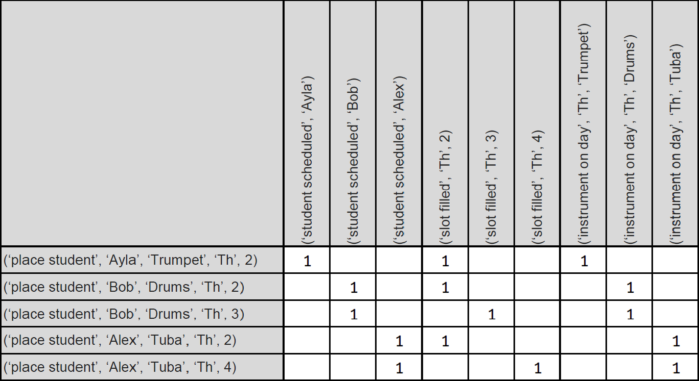

# Visualizing the Model

Algorithm X is often displayed as a matrix. The problem requirements are listed across the top as column headers. The possible actions are listed down the left side as row headers. 1s are placed in the appropriate boxes to indicate which requirements are covered by each action. 0s are often placed in the other cells, but I’m going to leave those cells blank in order to really highlight the locations of the 1s. Let’s take a look.

This visual should help you see where the term exact cover comes from. A proper solution is made up of a subset of rows that exactly covers all the columns. In our simple example, it is easy to see this can be accomplished by selecting rows 1, 3 and 5.
Think about the size of the matrix for 9x9 Sudoku: 243 columns and 729 rows, yet Algorithm X easily processes a matrix of this size to find all solutions! Later in this playground, I’ll demonstrate how Algorithm X works. For now, I need you to trust me. If you can build a proper model (requirements, actions and mapping from actions to the satisfied requirements), Algorithm X will easily find all the solutions.
In the next section, I’ll show you how to use an out-of-the-box AlgorithmXSolver to generate solutions for your models.
