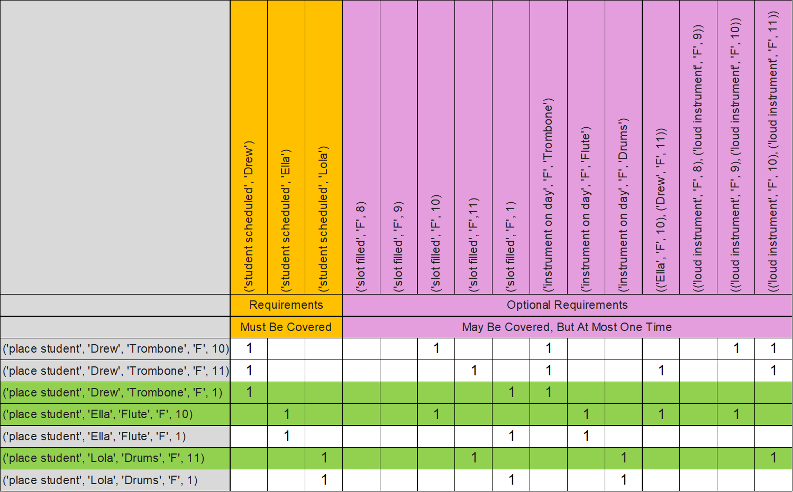
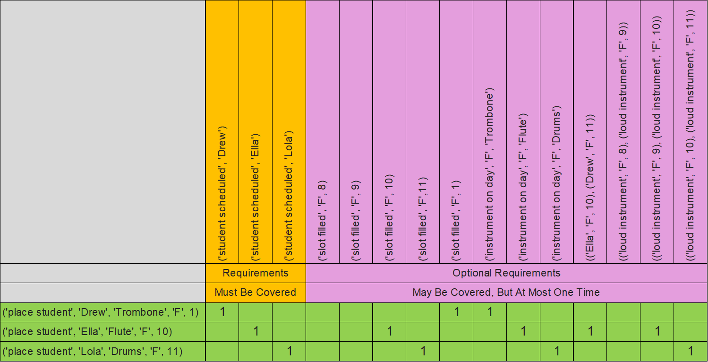

# Visualizing the Model - Mrs Knuth Part II

The matrix below shows which requirements are satisfied by each action. Mrs. Knuth - Part II has not added a tremendous amount of complexity, yet the matrix has grow enough, even on the sample exercise, that it is no longer trivial to identify an exact cover just by looking at it.
  

 
In the next matrix, the rows that make up a solution are highlighted.
  

 
Like we have done before, let's eliminate the unused rows to highlight the "exact cover".
  

 
In the next section, I’ll discuss how to add optional requirements to your AlogrithmXSolver subclass.
