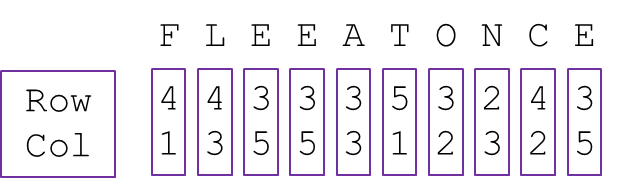
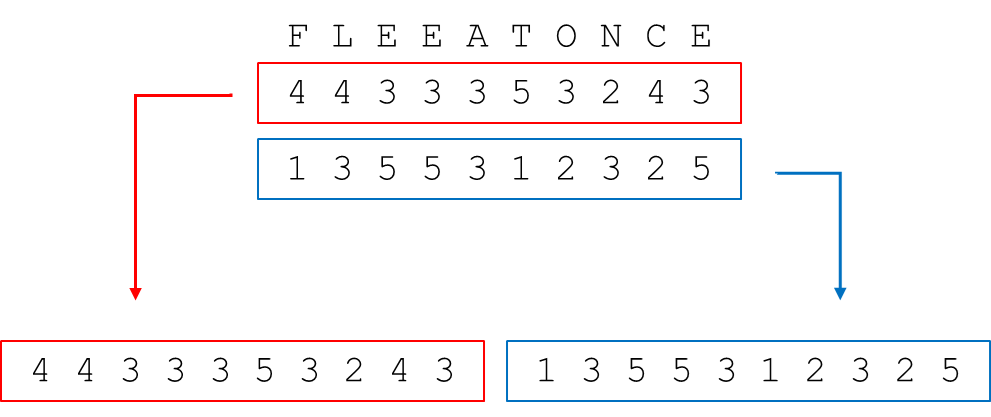
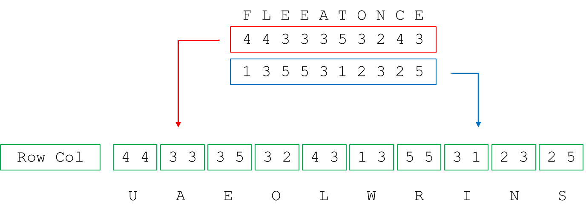

# Breaking Bifid

__Puzzle:__ [Breaking Bifid](https://www.codingame.com/training/hard/breaking-bifid)

__Author:__ [@therealbeef](https://www.codingame.com/profile/ecad91b9a50d51a3d9515d303487dd7c7077604)

__Published Difficulty:__ Hard

__Algorithm X Complexity:__ Imagine Untangling the Biggest Pile of Christmas Lights Ever

# Puzzle Overview

In Breaking Bifid, you are given a `plainText1` string and a `cipherText1` string. You need to figure out the makeup of the key, the _ Polybius_ square, used to encrypt `plainText1`. Once you have the key, you can decode a `cipherText2`.

I was able to put together a working solution using Algorithm X very quickly, but I have yet to find a way to make that solution fast. Maybe a variation of Algorithm X would help or maybe Algorithm X is just not the best fit for the problem. Either way, I found the puzzle a great Algorithm X learning exercise despite my solution being somewhat slow. Before we explore how to look at this problem as an exact cover, let’s first review the process laid out in the goal statement.

>Bifid uses a Polybius square as a key. This is a 5 by 5 square containing 25 letters of the alphabet (the J is merged with I), in an arbitrary order. For example:

  

 

>To encrypt a plaintext, we start by removing spaces and replacing each J by an I. Underneath each letter in the resulting text we write the coordinates (row and column) of that letter in the Polybius square:

  

 

>The two lines of numbers are written after each other:

  

 

>The numbers are then grouped in pairs, and the pairs are used as coordinates into the Polybius square (the first number being the row, and second being the column), to find the letters of the ciphertext:

  

 

# Looking at the Puzzle as an Exact Cover

Let’s now consider an example similar in structure to the text cases and try to identify actions and requirements for Algorithm X. In the next diagram, I have short 3-letter strings for `plainText1` and `cipherText1, but the entire Polybius square is completely blank.

  

 

The action steps I can take to build a solution are pretty simple. Each of the 25 letters (J is excluded) of the alphabet must be placed in one of the 25 squares. As for requirements, it 
