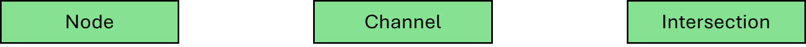
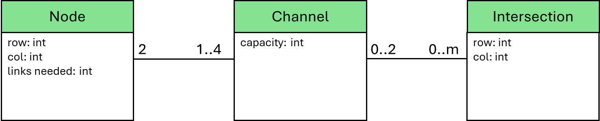
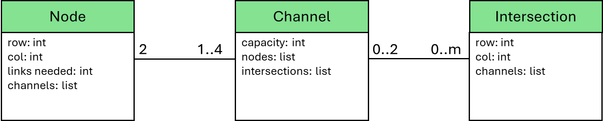

# There Is No Spoon - Episode 2 (cont.)

We just finished building the following detailed gameboard and a link can be placed on any dashed lines.

  

 

# An Object-Oriented Model of the Problem Space

Before we identify requirements and actions for Algorithm X, let’s take an inventory of what we see on our gameboard. We see a bunch of Nodes, a bunch of Intersections and a bunch of channels. Let’s create a class for each one of them.

  

 

How will the relationships among instances of these three classes be managed? What would somebody need to be able to recreate the gameboard? Consider the following:

* __Node__
    * has a (row, col) location on the gameboard
    * is connected to between 1 and 4 Channels
    * needs a certain number of links connected to it
    
* __Intersection__
    - has a (row, col) location on the gameboard
    - has 0, 1 or 2 Channels passing through it
 
* __Channel__
    - connects exactly 2 Nodes
    - has a capacity, some number of unused slots where links can be placed
    - has some number of used slots where links have been placed
    - has a list of 0 to many Intersections it passes through

These observations lead us to create the following object-oriented model of our problem space. 

  

 

I am streamlining the process a bit, but if we add a few attributes to the classes, we can make our model a bit more concrete. Some might call these features the difference between the object-oriented analysis model of the problem space and an object-oriented design model that guides us to an implementation.

  

 

# Beginning to Give the Gameboard Life

At this point, classes exist for each key abstraction on the gamboard. It is time to create instances of each class and build the relationships among the objects.

__Step 1:__ For every Node location on the initial gameboard, create an instance of the Node class. The only information available for a Node is the (row, col) location on the gameboard the number of needed links.

__Step 2:__ For every non-Node location on the initial gameboard, create an instance of an Intersection with nothing more than a (row, col) location.

Did you complete [There is No Spoon – Episode 1](https://www.codingame.com/training/medium/there-is-no-spoon-episode-1)? Now is the time to use what you learned on that puzzle. For every Node, determine if it has a horizontal neighbor to the right and determine if it has a vertical neighbor below. It is only necessary to check in 2 directions. As long as every node is explored in those two directions, all Channels will be found. 

__Step 3:__ For every Node, if there is a neighbor to the right, create a Channel and if there is neighbor below, create a second Channel. It should be straightforward to build a list of Intersections as you search for neighbors. When a Channel is created, it needs to know about the 2 Nodes it connects and it needs a list of Intersections it passes through.

That all for now. Not a single link has been placed, but the gameboard has been explored in tremendous detail and the perspective, with which the gameboard has been understood, is the key to the next step where the preliminary Object-Oriented Design guides the process of creating the matrix for Algorithm X.

# To Figure Out

This might be the toughest Algorithm X puzzle on Codingame. Using the techniques covered so far, you can solve most of the test cases. However, Test Case 8: Advanced and Test Case 13: Expert are just too big to solve purely with backtracking. A little later in the playground, I will cover problem-space reduction, and I’ll revisit this puzzle with a few more ideas that might help you find the finish line.

Let’s first talk about Test Cases 1 through 7, 9 and 10. They can all be solved with Algorithm X by following the processes covered in the Mrs. Knuth puzzles, but it will not be easy.

Lot’s of challenging multiplicity.

Algorithm X will generate multiple solutions for Test Cases 11 and 12 and you will need to determine which solution has a __single connected group__ of nodes.

Backtracking is guessing. Using only logic, no backtracking at all, you can solve 1 – 8 and 10.

Only a combination of pre-backtracking logic and Algorithm X can solve all the test cases.
