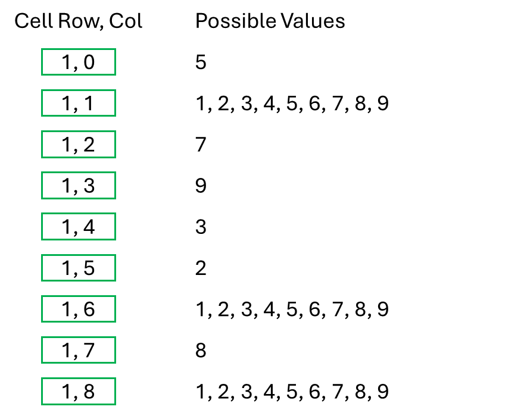
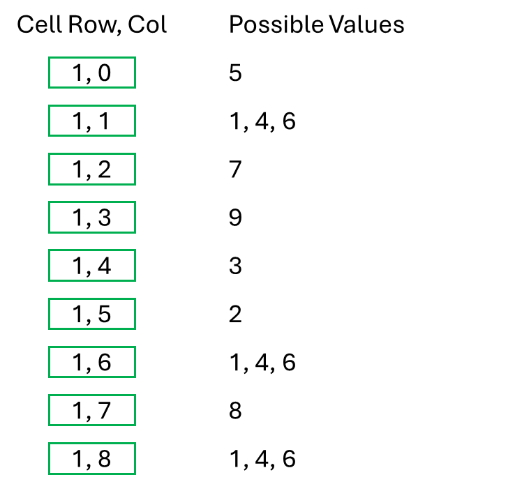
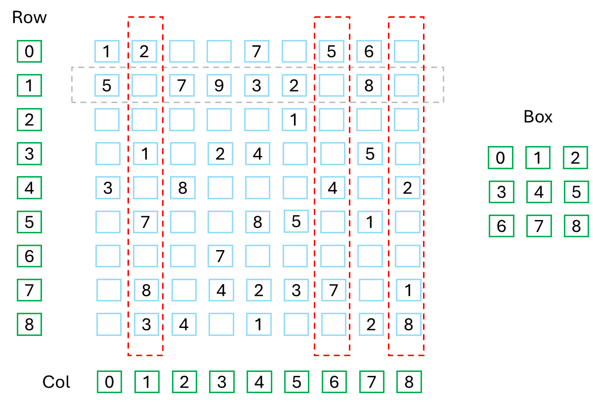
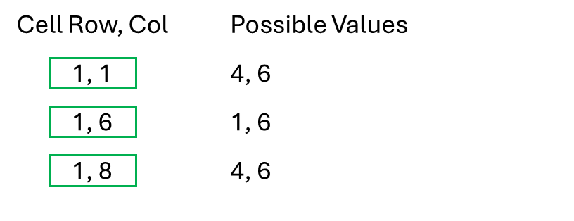
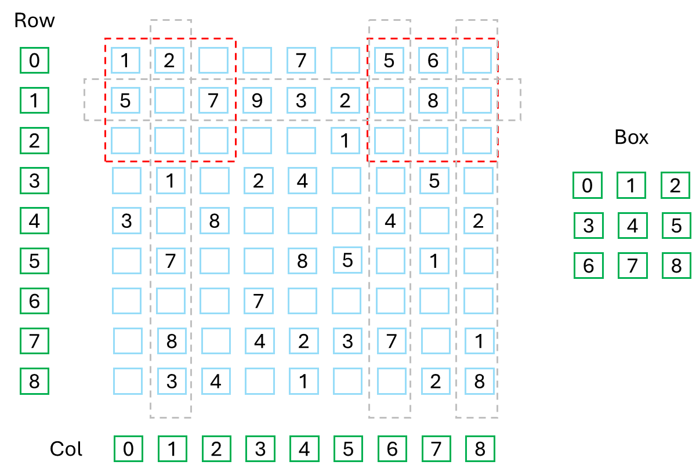
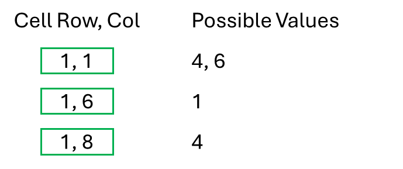
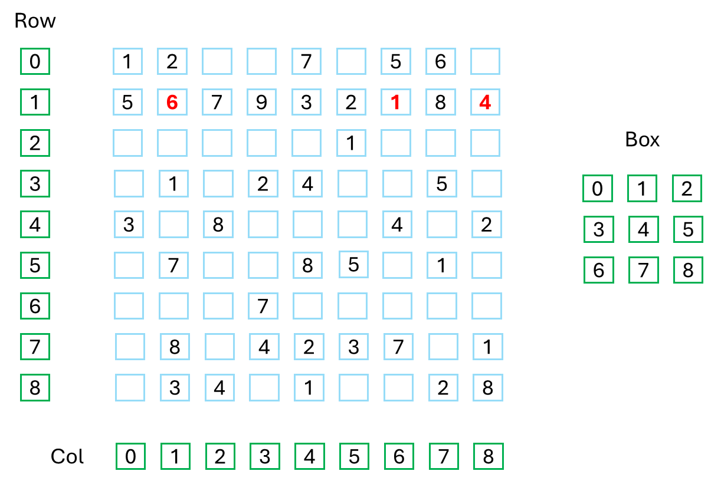

# Sudoku Problem-Space Reduction

To reduce the problem space of any problem, it is helpful to consider how you would go about solving the problem with a pencil and paper. With a Sudoku, you would look at each row, column and box separately. You would consider what you know about each group of cells and how that knowledge allows you to reduce the problem you still need to solve.

As a starting point with the Sudoku identified on the previous page, let's create a list of all possible numbers for each cell. If the cell is already known, that list constains a single number. If the cell is unknown, the initial list of possibile numbers contains all the numbers from 1 to 9.

We know from the rules of Sudoku that a row must have all the numbers from 1 to 9. The second row already has 6 known numbers, which makes it a seemingly good place to start.

  

 

The next diagram shows the possible numbers for each cell in row 2.

  

 

Because numbers cannot be duplicated in a row, the numbers in the known cells can be removed from each cell's list of possible numbers.

  

 

Each of the unknown cells is also in column where, again, numbers cannot repeat. Column 2 already has a 1. Column 6 already has a 4 and column 8 already has a 1. Based on the known numbers already found in each of the three columns, the lists of possible numbers can be reduced even further.

  

 

The three unknown cells in row 2 are now down to only 2 possibilities each.

  

 

Lastly, each of the unknown cells in row 2 is also part of a box and that box must not have duplicates. 

  

 

Box 0 does not help at this time, but box 2 already has a 6 and that 6 can be removed from the list of possibilities for each cell in box 2.

  

 

We have come full circle and it is again time to look at row 2 where we now see 8 of the 9 cells only have a single possibility. This makes it very easy to reduce the last cell to a single possibility and the Sudoku grid now looks like this:

  

 

# Putting It All Together

In a Sudoku, you have 9 rows, 9 columns and 9 boxes. All rows, columns and boxes behave exactly the same. Rather than using the terms rows, columns and boxes, I will call them all _Sudoku Cell Groups_. The problem can be generalized to 27 sudoku cell groupsf. Each group has 9 cells and each group must contain all the numbers from 1 to 9.

To reduce a Sudoku problem space, by hand or by algorithm, you must repeatedly loop through all 27 groups, logically reducing the possible numbers of any cell where you can. If you loop through all 27 groups and not a single update is made, your logic is either missing something or maybe the puzzle just cannot be solved completely with logic. Either way, you have no choice but to start guessing and backtracking where necessary.
