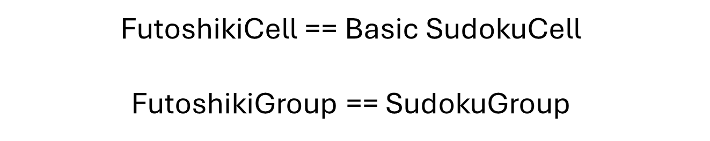

# Futoshiki Solver (Revisited)

__Puzzle:__ [Futoshiki Solver](https://www.codingame.com/training/medium/futoshiki-solver)

__Author:__ [@Sundiver](https://www.codingame.com/profile/a4d5c1786311a05772d1b2f5dadac78e6102203)

__Published Difficulty:__ Medium

__Algorithm X Complexity:__ Great Confidence Builder

# Strategy

The first time Futoshiki was discussed in this playground, a few key distinctions were made.

* Just like Sudoku, Futoshiki is a special kind of Latin Square.
* Inequalities allow for important problem-space reduction.

I think we all like to reuse code wherever possible. Here are a couple of conceptual ideas we know to be true:

<BR><BR>

<BR>

The Futoshiki input is somewhat tougher to parse, but you can use your exact same Sudoku code to create  `n * n` instances of the `SudokuCell` class. You can even use your previous code to create `SudokuGroup`s for each row and each column of the Futoshiki. Keep in mind, Futoshiki does not have boxes (sub-grids) like Sudoku. These groups will be important if you hope to solve all the Futoshiki test cases completely with logic, but they are not necessary if you plan to do backtracking with Algorithm X.

What I am about to say should not be a surprise and I hope I have not made a mistake by not issuing a spoiler alert, but… the inequalities are <u>really</u> important. They are so important; I suggest you add another class to your object model.

<BR><BR>

<BR>

Every `Inequality` needs two pointers. The first points to the `SudokuCell` that must be less than the other side. The second pointer points to the `SudokuCell` that must be greater than the other side. The only critical `Inequality` method is `reduce_(self)`. You will need to fill in the details of what it means to __reduce__ an inequality. As you know, reduction in this type of puzzle is all about eliminating candidates from cells. What candidates can be eliminated from the cells on either side of the inequality based on the rules that govern how inequalies work?

Finally, I will copy the exact code structure from the earlier Sudoku discussion into the FutoshikiSolver class constructor.

```python
        finished_reducing = False
        while not finished_reducing:
            finished_reducing = True
            for inequality in self.inequalities:
                if inequality.reduce_():
                    finished_reducing = False
```

<BR>

If you properly reduce the candidates based on the inequalities, you will completely solve several of the test cases before starting the backtracking. More importantly, reducing the candidates based on the inequalities puts Algorithm X in a position to solve __all__ test cases very fast.

As I alluded to earlier, a bit more than just basic `SudokuGroup` reduction logic is necessary to solve all test cases strictly with logic, no guessing, but it is very doable. If you would like to take on that challenge, I’ll get you started with the reduction loop, which probably does not come as a surprise by now.

```python
        finished_reducing = False
        while not finished_reducing:
            finished_reducing = True
            for inequality in self.inequalities:
                if inequality.reduce_():
                    finished_reducing = False

            for group in rows + cols:
                if group.reduce_():
                    finished_reducing = False
```
