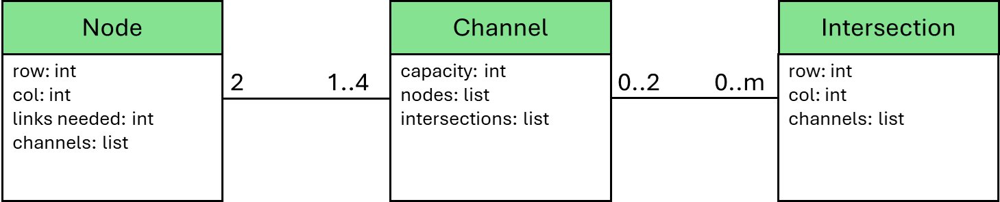

# There Is No Spoon - Episode 2

__Puzzle:__ [There Is No Spoon - Episode 2](https://www.codingame.com/training/hard/there-is-no-spoon-episode-2)

__Published Difficulty:__ Hard

__Algorithm X Complexity:__ Strap in and hold on tight!

# Reducing the Problem Space

When we last discussed There is No Spoon – Episode 2, I left you with the following class diagram:

  

 

To do some problem-space reduction, it seems reasonable we will add a `reduce()` method to one or more of the classes, but which ones? Distributing behavior to classes can be difficult and sometimes easy to argue one way or another. Let’s look at each class individually.

`Intersection` - this seems like the least likely location for a `reduce()` method. `Intersection`s have very little intelligence. They must be able to react to a single event sent by a `Channel` letting the `Intersection` know that a link has been placed and if there is another `Channel` in the intersection, it should be removed from the problem space and should be decommissioned.

`Channel` - this again seems like an unlikely location for a `reduce()` method. What would it even mean to reduce a `Channel`? Sure, the `Channel` knows about the `Nodes` on either side, but that is not enough to know whether or not a link must be placed in the `Channel`. I see a `Channel` needing to be able to react to two events:

1.	A `Node` might tell a `Channel` to place 1 or 2 links in its slots.
2.	A `Node` or an `Intersection` could send an event asking the `Channel`  to remove itself from the problem space. We already saw how this could happen with an `Intersection`. With a `Node`, links in other `Channel`s could bring the `Node`’s needed links down to zero. At that point, all `Channel`s attached to that `Node` become extraneous to the problem space.

`Node` - this seems like a very appropriate place for a `reduce()` method. A `Node` knows how many links it needs and it can easily calculate the total capacity of its `Channel`s. It seems very reasonable that reducing a `Node` could result in the `Node` asking one or more of its `Channels` to place 1 or 2 links in its slots.

# One Potential Sequence of Events

Based on everything said above, the following methods might be useful in each of the classes:

{classes with methods}

The next diagram captures one sequence of events that could result after a call to `reduce()` on a particular `Node`.

{sequence diagram}

You might think I have made this harder than it needs to be. I invite you to play around with it. If you choose to create an object-oriented structure for this puzzle, you can easily run into issues caused by less than optimum allocation of behavior to your classes.

# Your Goal

Backtracking is guessing. Using only logic, no backtracking at all, you can solve 1 – 8 and 10.

Only a combination of pre-backtracking logic and Algorithm X can solve all the test cases.

