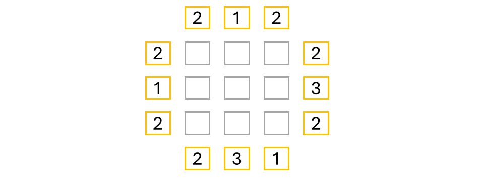
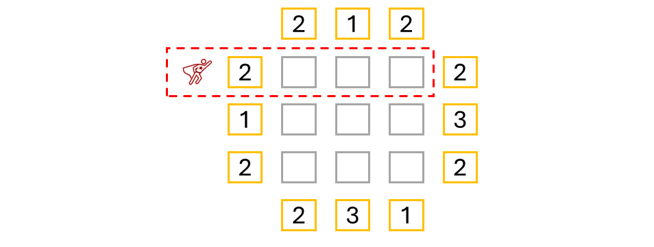
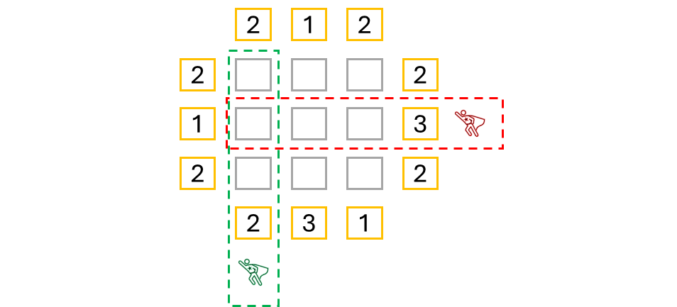
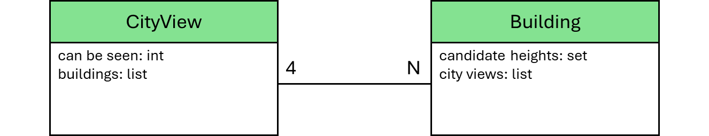

# This Road is a Dead End

You and a friend are driving from one side of Switzerland to the other. Your friend is driving while you study the map. Your friend turns down a road that your map clearly indicates is a dead end. Do you say anything?

Of course, the answer is, “It depends.” Your friend might be the kind of person that cannot tolerate a backseat driver. Your friend may be convinced the map is wrong. (I’m ashamed to admit I have been that friend.) However, if you share the goal of getting to your destination quickly, you let your friend know the current path is a dead end and you change course.

It is sometimes not possible to give Algorithm X every bit of knowledge necessary to find solutions with maximum speed. We only have requirements, optional requirements and actions with which to work. Some knowledge just doesn’t fit into those parameters.

Many pages ago, we discussed the matrix Algorithm X uses to find solutions. The columns are the requirements while the rows are the actions. Algorithm X uses backtracking to find a set of rows that _exactly covers_ the primary columns. In Mrs. Knuth – Part III, we added a couple lines of code to the `AlgorithmXSolver` method `_process_row_selection()` to ask Algorithm X to “remember” certain combinations it had already tried. We are going to override this method again, but this time I will add some logic to determine if Algorithm X is headed for a dead end and needs to be put back on a better path.

Each time Algorithm X selects a row to be part of a potential solution, a call is made to `_process_row_selection()`. In the following code, I am overriding that method and adding a very small amount of logic to update the state of the problem space and redirect Algorithm X if necessary. The pseudocode looks like this:

```text
    def _process_row_selection(self, row):
        action variables = unpack the row
        update the state of the problem space to include the selected action
        if the problem space is no longer valid:
            self.solution_is_valid = True
```


Anytime you implement this approach, you must also override the method `_process_row_deselection` to “undo” what was done when the row was selected. The pseudocode looks like this:

```text
    def _process_row_deselection(self, row):
        action variables = unpack the row
        update the state of the problem space to "undo" the selected action
```

This is a very minimal amount of code that can provide tremendous horsepower to Algorithm X. To see how it works, let’s take a closer look at the puzzle, [High-Rise Buildings]( https://www.codingame.com/training/expert/high-rise-buildings).


Here is diagram 1:

<BR><BR>

<BR>

Here is diagram 2:

<BR><BR>

<BR>

Here is diagram 3:

<BR><BR>

<BR>


Here is diagram 3:

<BR><BR>

<BR>
