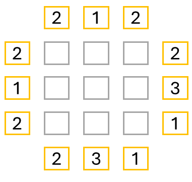
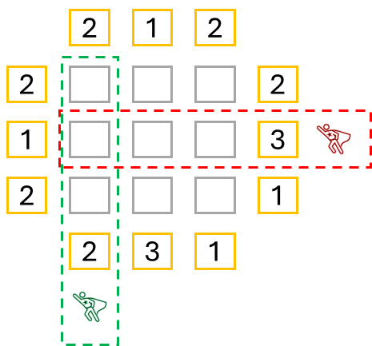

# High-Rise Buildings

__Puzzle:__ [High-Rise Buildings](https://www.codingame.com/training/expert/high-rise-buildings)

__Author:__ [@dwarfie](https://www.codingame.com/profile/2ad5cc4919ed368f16de4aecd570e21e477551)

__Published Difficulty:__ Very Hard

__Algorithm X Complexity:__ Setting Up Algorithm X is the Easy Part

# Strategy

Here is diagram 1:

  

 

Here is diagram 2:

  

 

Here is diagram 3:

  

 

Here is diagram 3:

  

 
