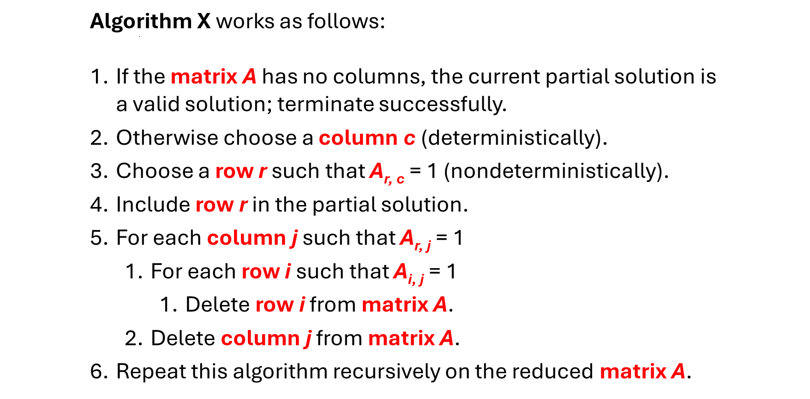

# Algorithm X. 

To have a conversation about customizing Algorithm X, it is necessary to first understand how Algorithm X works. You are welcome to study a detailed discussion in [Knuth’s The Art of Computer Programming](https://www-cs-faculty.stanford.edu/~knuth/taocp.html) or a well-done summary on [Wikipedia]( https://en.wikipedia.org/wiki/Knuth%27s_Algorithm_X). There is little benefit to me repeating that material here.

In the next graphic, I have copied the algorithm provided on Wikipedia which came from Knuth. I strongly recommend you work your way through the step-by-step Algorithm X example provided on Wikipedia to gain an understanding of how Algorithm X processes the matrix rows and columns to find solutions.

  

  

# Long Pause

As I move forward with customization options, I will assume you have a reasonable idea how the above algorithm works. I am sure you noticed you can solve a lot of exact cover problems without understanding the details of the algorithm, but if you want to do any customization, you will need a basic understanding of the internal Algorithm X mechanics. I must admit, I went through the example on Wikipedia more times than I can count as I worked my way through the various exact cover puzzles. Take as much time as you need!

# What Can Be Customized?

Looking at the algorithm above, Step 2 and Step 3 both involve making a choice. In Step 2, a column is chosen from all yet-to-be-covered columns in the matrix. Once a column is chosen, Step 3 loops through all rows that cover that column and those rows are chosen in some order. In certain situations, __especially when the matrix is large__, these choices can make a meaningful difference.

You do have some influence over how rows and columns are chosen simply by how you set up the matrix. In the absence of detailed instruction, `AlgorithmXSolver` will choose colummns from left to right and rows from top to bottom. `AlgorithmXSolver` has one level of default sorting instructions when choosing a column in Step 2 and no instructions for choosing a row in Step 3. However, it is easy to customize the process of choosing a column, choosing a row or both.

Before I cover how to customize each of these selection processes, we must first have a short discussion about [Dancing Links (DLX)]( https://en.wikipedia.org/wiki/Dancing_Links) and the DLX implementation used in `AlgorithmXSolver`.
