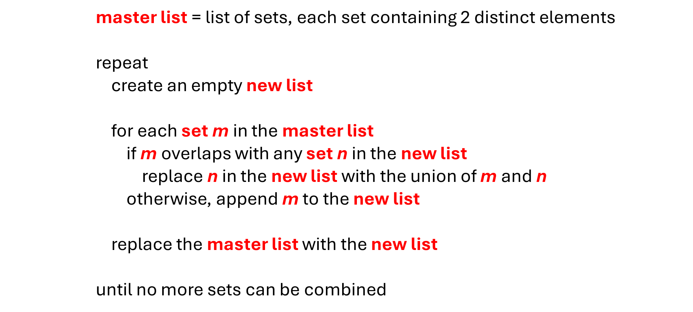

# Hmmm?

The Scavenger Hunt made it very easy to identify the all-or-none sets of events as the children could simply be grouped by last name. It is more common to have many sets of events that contain only 2 elements and it is up to you to combine the sets where possible and build a minimum number of completely independent sets. Let’s explore a short algorithm for doing that.

In the realm of sameness, the fundamental building block is two items that need to be the same. For instance, `A` must be the same as `B`. Given a list of sets, where each set contains 2 elements that must be the same, the following pseudocode reduces that list to a minimum number of sets, where no 2 sets have any overlap.

  

 

# Test Your Skills

@[Minimize the list of all-or-none sets of events.]({"stubs": ["all_or_none.py"], "command": "python3 all_or_none_test.py"})
