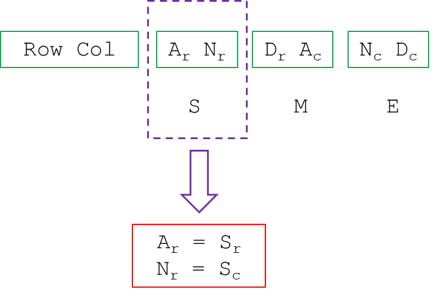

# Breaking Bifid (Revisited)

__Puzzle:__ [Breaking Bifid](https://www.codingame.com/training/hard/breaking-bifid)

__Author:__ [@therealbeef](https://www.codingame.com/profile/ecad91b9a50d51a3d9515d303487dd7c7077604)

__Published Difficulty:__ Hard

__Algorithm X Complexity:__ Imagine Untangling the World's Largest Pile of Holiday Lights


# All-or-None Sets of Events

Breaking Bifid is a complex puzzle and I encourage you to revisit the [original discussion](breaking-bifid) that ended with the following graphic:

<BR><BR>

<BR>


Drawing two more purple boxes around the `M` and the `E` produces the following:

```python
('row', 'A') must be equal to ('row', 'S')
('row', 'N') must be equal to ('col', 'S')
('row', 'D') must be equal to ('row', 'M')
('col', 'A') must be equal to ('col', 'M')
('col', 'N') must be equal to ('row', 'E')
('col', 'D') must be equal to ('col', 'E')
```

Each row above is an all-or-none set of events. The two elements in each row must be the same. There is no overlap in this toy example, but if there was, you would probably want to review the exercise a few pages back and combine any sets that had overlap.

# Enforcing Sameness with Colors

When this puzzle was originally discussed, I wrote the following:

Each time a letter is placed on the grid, that letter is assigned to a particular row and column. Based on the all-or-none sets of events, several other letters might need to have their row or column colored with the same number. The first step in a coloring solution is to add an attribute to your solver to keep track of color assignments. In this case, two attributes could be used, one for row assignments and one for column assignments.

```
        row_color_assignments = {letter:[] for letter in all_letters_in_plaintext_or_ciphertext}
        col_color_assignments = {letter:[] for letter in all_letters_in_plaintext_or_ciphertext}
```

We might also consider the following to keep track of colors with a single attribute:

```
        color_assignments = {letter:{'row':[], 'col':[]} for letter in all_letters_in_plaintext_or_ciphertext}
```


# Enforcing Sameness with Complex Actions

>The action steps I can take to build a solution are pretty simple. One at a time, a letter of the alphabet (J is excluded) can be placed in one of the 25 squares. As for requirements, the only obvious requirements are that every letter be used and every square be covered.


